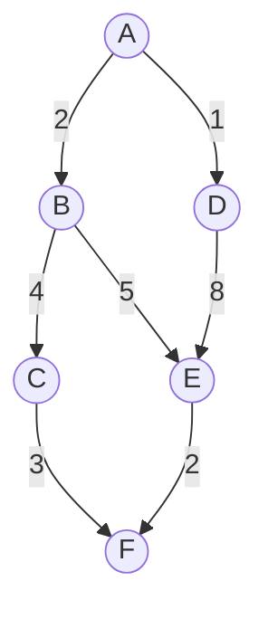

# DisMLec25

Created: October 10, 2024 9:32 AM
Class: COMP6005
Reviewed: No

The document you uploaded covers key topics in **weighted graphs** and relevant **algorithms** for solving problems such as finding the **minimum spanning tree**, solving the **travelling salesman problem**, and identifying the **shortest path** between vertices. Here's an expanded set of notes based on the lecture slides:

---

### 1. **Weighted Graphs**

A **weighted graph** is a graph G where a **weight function** assigns a non-negative weight to each edge ⁍, typically represented as:
w: E → R+, where w(e) denotes the weight of edge e.
这里，w 是一个将边 E 映射到非负实数 R+ 的函数，w(e) 表示边 e 的权重。

### Examples:

- **Airline networks**: Vertices represent airports, edges represent flights, and weights correspond to either air miles or cost.
- **Telecommunications**: Vertices represent routing stations, edges connect stations, and weights are the cost of laying fiber.
- **Internet connections**: Vertices represent nodes, edges are direct connections, and weights represent data transmission time.

---

### 2. **Optimization Problems on Weighted Graphs**

Several key problems are commonly solved using weighted graphs:

### 2.1 **Minimal Spanning Tree (MST)**

The goal is to find a spanning tree with the minimum possible total weight from a given weighted graph. This problem can be efficiently solved using **Kruskal's Algorithm** or **Prim's Algorithm**.

### 2.2 **Travelling Salesman Problem (TSP)**

The task is to find a **Hamiltonian circuit** (a circuit that visits each vertex exactly once and returns to the start) of minimal total weight. TSP is an **NP-hard** problem, meaning no known algorithm can solve it efficiently for large graphs.

### 2.3 **Shortest Path Problem**

Given two vertices, the objective is to find the path between them that has the smallest total weight. This problem is commonly solved using **Dijkstra's Algorithm** for graphs without negative weights.

好的,我会为您解释选中部分的内容。这部分讲述了加权图中的三个主要优化问题:

- **最小生成树 (MST)**: 目标是在给定的加权图中找到总权重最小的生成树。这个问题可以通过Kruskal算法或Prim算法高效解决。
- **旅行商问题 (TSP)**: 任务是找到一个最小总权重的哈密顿回路(一个恰好访问每个顶点一次并返回起点的回路)。TSP是一个NP难问题,意味着对于大型图,没有已知的算法能够有效地解决它。
- **最短路径问题**: 给定两个顶点,目标是找到它们之间总权重最小的路径。对于没有负权重的图,这个问题通常使用Dijkstra算法来解决。

这些都是加权图中常见的优化问题,每个问题都有其特定的解决方法和应用场景。

---

### 3. **Minimal Spanning Tree (MST) with Kruskal’s Algorithm**

**Kruskal’s Algorithm** is a **greedy** algorithm that builds the MST by repeatedly adding the smallest edge that doesn’t form a cycle. It proceeds as follows:

1. Initialize the tree T to have all vertices of G, but no edges. Initialize total weight W=0.
2. Pick the smallest edge e from G and remove it.
3. If adding e to T does not form a cycle, include it in T and add its weight to W.
4. Repeat steps 2-3 until T contains n−1 edges (where n is the number of vertices).

**Example**:

Given a weighted graph with vertices A, B, C, D, E and edges:

$\text{Edges}: \{AB: 1, AC: 5, BD: 4, CD: 2, CE: 3\}$

Kruskal’s algorithm would produce a minimal spanning tree with total weight W = 9

好的,我来为您解释选中部分的内容。这部分讲述了最小生成树(MST)和Kruskal算法:

**最小生成树(MST)与Kruskal算法**

Kruskal算法是一种贪心算法,用于构建最小生成树。它的工作原理如下:

1. 初始化树T,包含图G的所有顶点但没有边。初始化总权重W=0。
2. 从G中选择最小的边e并移除。
3. 如果将e添加到T中不会形成环,则将其包含在T中,并将其权重加到W上。
4. 重复步骤2-3,直到T包含n-1条边(其中n是顶点数)。

这个算法通过反复添加不形成环的最小边来构建最小生成树。它是一种贪心策略,因为在每一步都选择当前可用的最佳选项。

例如,给定一个带有顶点A, B, C, D, E的加权图,Kruskal算法会产生一个总权重W = 9的最小生成树。

这种方法保证了在每一步都选择最优的局部解,最终得到全局最优解,即最小生成树。

---

### 4. **Greedy Algorithms**

A **greedy algorithm** tries to build an optimal solution by making the locally optimal choice at each step. Kruskal’s algorithm is an example of a successful greedy algorithm since it always produces an MST.

### **Properties of Greedy Algorithms:**

- **Locally optimal choices**: The algorithm selects the best option available at each stage, without considering future consequences.
- **Global optimality**: For some problems like MST, this approach guarantees an optimal solution. However, for other problems like TSP, greedy algorithms may fail to find the best solution.
    
    好的,我来为您解释选中部分的内容。这部分讲述了贪心算法:
    
    **贪心算法**
    
    贪心算法试图通过在每一步做出局部最优选择来构建最优解。Kruskal算法是一个成功的贪心算法的例子,因为它总是能产生最小生成树(MST)。
    
    贪心算法的特性:
    
    - **局部最优选择**：算法在每个阶段选择当前可用的最佳选项,而不考虑未来的后果。
    - **全局最优性**：对于某些问题(如最小生成树),这种方法保证能得到最优解。然而,对于其他问题(如旅行商问题),贪心算法可能无法找到最佳解决方案。
    
    这种方法在某些情况下非常有效,但并不总是能保证全局最优解。它的优势在于简单和高效,但在某些复杂问题上可能会得到次优解。
    

---

### 5. **Travelling Salesman Problem (TSP) and Nearest Neighbor Algorithm**

The **Nearest Neighbor Algorithm** is a greedy approach to solving the TSP. It works as follows:

1. Choose any starting vertex and mark it as visited.
2. Move to the nearest unvisited vertex.
3. Repeat step 2 until all vertices are visited, then return to the start vertex to complete the circuit.

**Limitation**: Nearest Neighbor does not guarantee the optimal Hamiltonian circuit, and often returns suboptimal solutions.

好的,我来为您解释选中部分的内容。这部分讲述了旅行商问题(TSP)和最近邻算法:

**旅行商问题(TSP)和最近邻算法**

最近邻算法是一种用于解决旅行商问题的贪心方法。它的工作原理如下:

1. 选择任意一个起始顶点并标记为已访问。
2. 移动到最近的未访问顶点。
3. 重复步骤2,直到所有顶点都被访问,然后返回起始顶点以完成回路。

**局限性**：最近邻算法不能保证得到最优的哈密顿回路,而且经常返回次优解。

这种方法虽然简单直观,但它的主要问题是可能会错过更优的全局解决方案。在某些情况下,它可能会产生比最优解长得多的路径。尽管如此,由于其实现简单且计算速度快,最近邻算法仍然是解决TSP的一种常用启发式方法,特别是在处理大规模问题或需要快速近似解的情况下。

---

### 6. **Shortest Path Problem: Dijkstra’s Algorithm**

**Dijkstra's Algorithm** is designed to find the shortest path between a starting node and all other nodes in a graph with non-negative weights. The steps are:

1. Set the distance to the source vertex to 0 and all other vertices to infinity.
2. Mark all vertices as unvisited. Set the source vertex as the current node.
3. For each neighbor of the current node, calculate their tentative distance (current node's distance + edge weight).
4. Mark the current node as visited and move to the unvisited vertex with the smallest tentative distance.
5. Repeat the process until the shortest path to the destination is found.

**Example**:
In a graph with vertices A, B, C, D, E and edge weights, if you are looking for the shortest path from A to C, Dijkstra's algorithm systematically calculates the shortest distances by updating the tentative distances and locking in the shortest known path.

好的,我来为您解释选中部分的内容。这部分讲述了最短路径问题和Dijkstra算法:

**最短路径问题：Dijkstra算法**

Dijkstra算法是设计用来在带有非负权重的图中找到一个起始节点到所有其他节点的最短路径。算法步骤如下：

1. 将起始顶点的距离设为0，所有其他顶点的距离设为无穷大。
2. 将所有顶点标记为未访问。将起始顶点设为当前节点。
3. 对于当前节点的每个邻居，计算它们的临时距离（当前节点的距离 + 边的权重）。
4. 将当前节点标记为已访问，并移动到临时距离最小的未访问顶点。
5. 重复这个过程，直到找到到目标顶点的最短路径。

例如，在一个包含顶点A、B、C、D、E和边权重的图中，如果你要寻找从A到C的最短路径，Dijkstra算法会通过更新临时距离并锁定已知的最短路径来系统地计算最短距离。

这个算法的主要优点是它能够有效地找到一个起点到图中所有其他点的最短路径，特别适用于路由规划和网络优化等问题。

---

These expanded notes explain the key algorithms and concepts from the slides. Let me know if you'd like to dive deeper into any specific topic!

